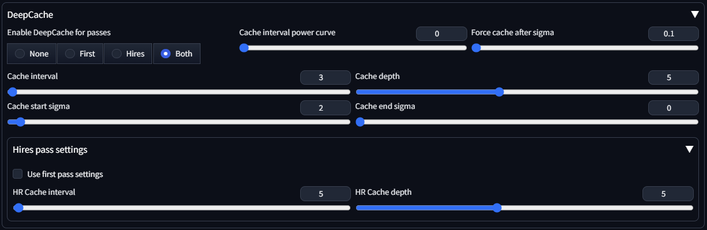

# DeepCache for SD Forge

This is an implementation of [DeepCache: Accelerating Diffusion Models for Free](https://horseee.github.io/Diffusion_DeepCache/) for [SD Forge](https://github.com/lllyasviel/stable-diffusion-webui-forge). The core is basically [laksjdjf's ComfyUI node](https://gist.github.com/laksjdjf/435c512bc19636e9c9af4ee7bea9eb86), with a few of my own improvements.

Only tested with SDXL, but should work with other models.

## Installation

`git clone https://github.com/LoganBooker/sd-deepcache.git` into `stable-diffusion-webui-forge/extensions/` folder.

> [!WARNING]
> The extension patches the Unet forward pass, so other extensions that also do this might not play nicely. There is no easy fix as far as I'm aware.

## Improvements

- Keyed-cache dictionary to handle situations where the batch size changes during diffusion. This fixes errors such as `Expected size 2 but got size 1 for tensor number 1 in the list`, which is common when other extensions manipulate conditional/unconditional batching, such as Perturbed-Attention Guidance.
- Cache interval power curve to increase the interval over time. A hard value to tune, but 4 works well when applying the cache from start to finish.
- Forcing the cache on after a certain sigma, which helps to avoid one or more costly and usually unneeded caching steps near the end of diffusion.

## Parameters

- `Enable DeepCache for passes`: Passes to apply DeepCache. None, first pass only, hires pass only, or both (recommended).
- `Cache interval power curve`: Optionally increase the cache interval over time. Starts at 1 and increases to `Cache interval` following a [power curve](https://www.wolframalpha.com/input?i=plot+pow%28x%2C+4%29+from+0+to+1). Set to 0 to disable (default).
- `Force cache after sigma`: Sigma to ignore the cache interval and always use the cache. Avoids costly caching steps when noise levels are very low. Default is 0.1.
- `Cache start sigma`: Sigma to enable the cache. Higher values enable caching sooner, but will reduce quality. Values between 5-1 are recommended, if using default sigmas ([0.29, 14.6]).
- `Cache end sigma`: Sigma to disable the cache. This should be lower than `Cache start sigma`. I'd recommend leaving this at 0, as disabling the cache deep into the diffusion process offers few benefits (at least for SDXL).
- `Cache interval`: Frequency of cache steps. Lower values (2-3) are slower but higher quality. Values above 5 are usually too destructive, but might not be bad for high step counts (50+).
- `Cache depth`: Layer to apply caching. Lower values are faster, but reduce quality. For SDXL, a value of 4 or higher is recommended. Default is 5.

## Hires parameters

For the hires pass, all the above settings are not used, except for the cache interval and cache depth.

- `Use first pass settings`: Ignore the values specified in the hires section and use the `Cache interval` and `Cache depth` from the main parameters.
- `HR Cache interval`: if `Use first pass settings` is disabled, use this value for `Cache interval`.
- `HR Cache depth`: if `Use first pass settings` is disabled, use this value for `Cache depth`.
